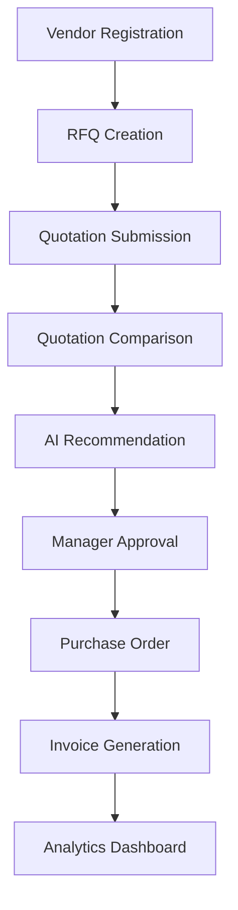

<div align="center">

# 🚀 VendorBridge
### AI-Powered Procurement Intelligence Platform

<p align="center">
  
  
  
  
  
</p>

<p align="center">
  <strong>Transforming Procurement into Intelligence</strong>
</p>

<p align="center">
VendorBridge is an AI-powered Procurement Intelligence Platform that helps organizations select better vendors, detect procurement risks, automate approvals, and optimize purchasing decisions through real-time analytics and intelligent recommendations.
</p>

</div>

---

## 🌟 Why VendorBridge?

Traditional Vendor Management ERPs focus only on storing procurement data.

VendorBridge goes beyond management and introduces:

- 🤖 AI Vendor Recommendation
- 🛡️ Vendor Trust Score
- ⚠️ Procurement Risk Detection
- 📈 Procurement Health Score
- 💰 Procurement Savings Analytics
- 🚀 Smart Approval Escalation
- 💬 AI Procurement Assistant

---

# 🎯 Problem Statement

Organizations often struggle with:

❌ Manual Vendor Evaluation

❌ Delayed Approval Processes

❌ Lack of Vendor Risk Visibility

❌ Poor Procurement Analytics

❌ Costly Vendor Selection Decisions

❌ Procurement Fraud Risks

VendorBridge solves these problems through intelligent procurement workflows and AI-driven insights.

---

# 🏗️ System Workflow



---

# ✨ Core Features

## 👥 Vendor Management

- Vendor Registration
- GST Verification
- Vendor Categories
- Search & Filtering
- Vendor Status Tracking

---

## 🏆 Vendor Trust Score

Evaluate vendor reliability using business intelligence metrics.

### Trust Score Formula

```text
40% Delivery Performance

20% Response Speed

20% Vendor Rating

10% GST Verification

10% Profile Completeness
```

### Example

```text
Trust Score

92 / 100

🟢 Excellent Vendor
```

---

## 🤖 AI Vendor Recommendation

Automatically recommend the most suitable vendor.

### Evaluation Model

```text
40% Price Competitiveness

30% Delivery Timeline

20% Trust Score

10% Historical Performance
```

### Example

```text
Recommended Vendor

ABC Suppliers

Reason:
✓ Lowest Procurement Risk
✓ Fast Delivery
✓ Strong Vendor Rating
✓ Competitive Pricing
```

---

## ⚠️ Procurement Risk Detection

Detect potential procurement issues before they occur.

### Risk Indicators

- Missing GST
- Low Vendor Trust Score
- Delayed Deliveries
- Expired Documents
- High Pricing
- Approval Delays

### Risk Levels

| Level | Color |
|---------|---------|
| Safe | 🟢 |
| Warning | 🟡 |
| Critical | 🔴 |

---

## 📊 Procurement Health Dashboard

Single-screen visibility into procurement performance.

### KPIs

- Active RFQs
- Total Vendors
- Pending Approvals
- Vendor Risks
- Monthly Savings
- Procurement Health Score

Example:

```text
Procurement Health

87%
```

---

## 💰 Procurement Savings Tracker

Track money saved through vendor comparison.

```text
Vendor A : ₹100,000

Vendor B : ₹90,000

Savings : ₹10,000
```

---

## 💬 AI Procurement Assistant

Ask questions in natural language.

Examples:

```text
Which vendor should I choose?

Show risky vendors.

Monthly procurement summary.

Pending approvals?
```

---

# 📸 Dashboard Preview

## Executive Dashboard

```text
┌──────────────────────────┐
│ Procurement Health 87%   │
├──────────────────────────┤
│ Active RFQs      25      │
│ Risk Vendors      2      │
│ Pending Approval  5      │
│ Savings        ₹45,000   │
└──────────────────────────┘
```

---

# 🛠️ Tech Stack

## Frontend

- Next.js
- React
- TypeScript
- Tailwind CSS
- ShadCN UI
- Framer Motion

## Backend

- Node.js
- Express.js

## Database

- PostgreSQL
- Supabase

## Authentication

- JWT
- RBAC

## AI Layer

- Google Gemini API

---

# 🔥 What Makes VendorBridge Different?

| Traditional ERP | VendorBridge |
|-----------------|--------------|
| Vendor CRUD | AI Vendor Intelligence |
| Manual Decisions | AI Recommendations |
| Static Reports | Real-Time Analytics |
| No Risk Visibility | Risk Detection Engine |
| Basic Dashboard | Procurement Command Center |
| Data Storage | Decision Support Platform |

---

# 🚀 Future Scope

- Predictive Procurement Analytics
- Vendor Fraud Detection
- AI Contract Analysis
- OCR Invoice Processing
- WhatsApp Notifications
- Blockchain Audit Logs

---

# 👨‍💻 Team

Built with ❤️ during Hackathon

### Team Name
VendorBridge

### Vision

> Making Procurement Intelligent, Not Just Digital.

---

<div align="center">

### ⭐ Star this repository if you like the project ⭐

</div>
